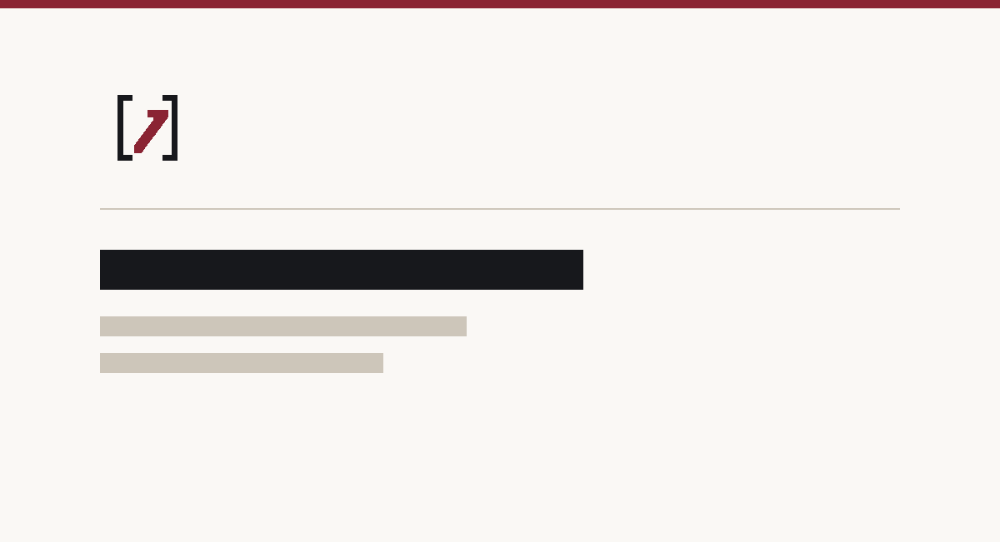

# Accelerate Legal



Accelerate Legal is an open-source legal AI platform for document review,
drafting, and legal research.

It combines a Next.js frontend, an Express backend, Supabase Auth/Postgres,
and Cloudflare R2-compatible object storage.

Accelerate Legal is a modified version of
[Mike](https://github.com/Open-Legal-Products/mike) and is released under the
same license, the GNU Affero General Public License v3.0. See
[NOTICE](NOTICE) for what came from upstream and what was added here.

## Features

- Chat with legal documents and open matters
- Review documents and apply suggested edits
- Run reusable assistant and tabular-review workflows
- Organize projects, folders, and a document library
- Verify citations and research US case law with CourtListener
- Browse a curated catalog of legal-AI datasets, benchmarks, and research sources
- Work from Microsoft Word with the beta task-pane add-in
- Use the native macOS app, which wraps the hosted web app with system-browser
  sign-in, deep links, and background updates
- Run supported language models locally through Ollama

## Quick start

The included Docker Compose stack runs Accelerate Legal, Supabase, RustFS object storage,
and local email capture without requiring managed infrastructure.

1. Copy the local environment templates:

   ```bash
   cp .env.example .env
   cp backend/.env.example backend/.env
   ```

2. In `backend/.env`, set `DOWNLOAD_SIGNING_SECRET` and
   `USER_API_KEYS_ENCRYPTION_SECRET` to separate values generated with:

   ```bash
   openssl rand -hex 32
   ```

3. Add an Anthropic, Gemini, or OpenAI API key to `backend/.env`, unless you
   plan to use Ollama exclusively.

4. Start the stack:

   ```bash
   docker compose up --build
   ```

5. Open [http://localhost:3000](http://localhost:3000) and create an account.

The bundled credentials and infrastructure are intended for local development
only. See [Local development](docs/local-development.md) for service endpoints,
authentication behavior, Ollama setup, and first-run guidance.

## Repository

| Path | Purpose |
| --- | --- |
| `frontend/` | Next.js web application |
| `backend/` | Express API, document processing, and database access |
| `word-addin/` | Microsoft Word task-pane add-in (beta) |
| `desktop/` | macOS desktop app (Electron shell around the hosted web app) |
| `backend/schema.sql` | Complete schema for fresh databases |
| `backend/migrations/` | Dated migrations for existing deployments |
| `scripts/import-legal-ai-resources.mjs` | Regenerates the Legal AI resources catalog |
| `docker-compose.yml` | Local application and infrastructure stack |
| `docs/` | Development, deployment, testing, and feature guides |
| `LICENSE` | GNU Affero General Public License v3.0 |
| `NOTICE` | Upstream attribution and bundled third-party content |

## Documentation

- [Documentation index](docs/README.md)
- [Local development](docs/local-development.md)
- [Manual and production deployment](docs/deployment.md)
- [Troubleshooting](docs/troubleshooting.md)
- [CourtListener integration](docs/courtlistener.md)
- [Microsoft Word add-in](word-addin/README.md)
- [macOS desktop app](desktop/README.md)
- [Tamper-evident exports](docs/tamper-evident-exports.md)
- [Safe local testing](docs/safe-local-testing.md)
- [End-to-end testing](docs/e2e-testing.md)
- [Contributing](CONTRIBUTING.md)
- [Security policy](SECURITY.md)

## License

Accelerate Legal is free software under the
[GNU Affero General Public License v3.0](LICENSE) (AGPL-3.0-only).

It is a modified version of [Mike](https://github.com/Open-Legal-Products/mike),
which is licensed under the same terms. [NOTICE](NOTICE) records the upstream
work, the modifications made here, and the third-party content this repository
bundles.

If you run a modified version of this software as a network service, AGPL
section 13 requires you to offer its source to the people who use it.
